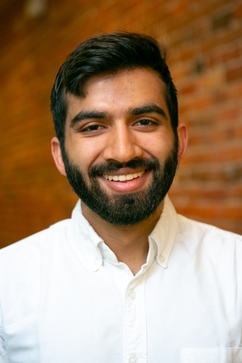

# About

Hi\! My name is Sachit; I’m a student at Duke University studying math and computer science as an A.B. Scholar. My primary interests lie in deep learning and AI more generally (both fundamental methods and applications, in that order). I’m particularly interested in unsupervised learning, especially representation learning and generative modeling, as well as methods that reason with uncertainty. This website (very much under construction) exists mostly as a place for me to consolidate my explorations in these topics – and hopefully as an introduction to others interested in them too\!

I hope to use my time as an undergrad to develop a unique perspective on AI that brings together a variety of fields. In addition to the core of linear algebra, mathematical optimization, probability, theoretical computer science, and general machine learning one would expect from any hopeful ML researcher, I have a working background in neuroscience. Recently, I’ve also been working on cultivating an understanding of topological data analysis and Bayesian methods.

Last summer, I had the opportunity to work at the intersection of these interests as a research intern at a stealth neurotech startup, focusing on data analysis and machine learning in the context of the brain. Prior to that, I spent time studying science ethics at Oxford, devising algorithms for sensor network analysis for cold storage logistics, and doing basic neuroscience research. Feel free to reach out\!
